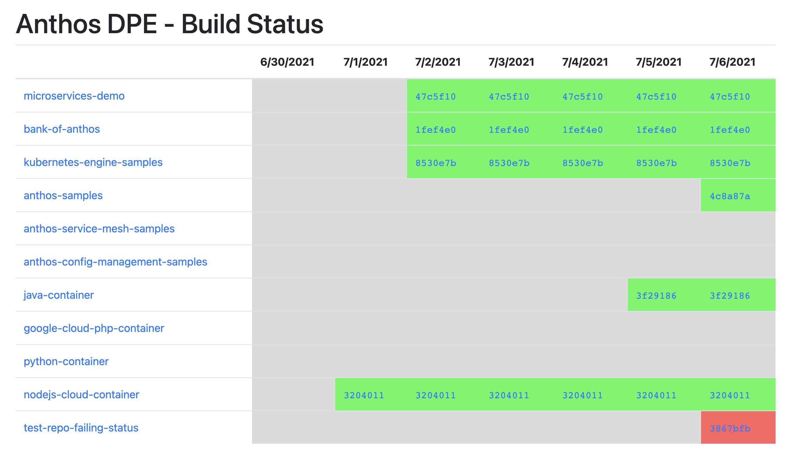
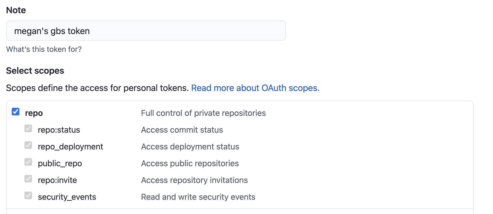

# Github Build Status 

Github Build Status (GBS) is a small UI-based utility that shows the Github build status for one or more repositories. GBS works for any CI system (eg. Github Actions, Kokoro) that writes a build check result to a repo. 

GBS is based on the [Testgrid](https://github.com/GoogleCloudPlatform/testgrid) project. 

## How it works 

GBS works by periodically querying the Github API to get the latest Build for each repo. It then keeps track of a week's worth of build history and displays those results in a grid UI: 



For state, GBS relies on both an in-memory cache and a Redis cache. The in-memory cache is what you see in the UI. GBS periodically writes the in-memory cache to Redis, so that if the GBS service crashes, it can get reasonably up-to-date build statuses from Redis when it starts up again. 

## Setup 

To run your own GBS instance, follow the steps below. 

### Prerequisites 

1. A Kubernetes cluster. 
2. A Github API token tied to your Github account. You can create a token by [going to this page](https://github.com/settings/tokens/new) and creating a new token with `repo` access: 



**Copy the token** to your clipboard. 

### Steps 

1. Connect to your Kubernetes cluster, so that you can run `kubectl` commands against it. 

2. Create a Kubernetes Secret from your copied Github token. 

```
TOKEN=<your-token-value>
kubectl create secret generic github-token --from-literal token=$TOKEN
```

3. Create a repo configuration file. This is app-specific config, where you list your repo name, the org/user they belong in, and their default branches (eg. `main`). `sample-config.yml` provides an example. Edit `sample-config.yml` with your repo values. 


4. Create a Kubernetes ConfigMap from `sample-config.yml`. This will allow the GBS Deployment 

```
kubectl create configmap gbs-repo-config --from-file=`pwd`/sample-config.yml
```


5. Deploy the Kubernetes Manifests to your GKE cluster. 

```
kubectl apply -f kubernetes-manifests
```

This will deploy the following: 
- a **Redis Deployment** 
- a **Redis Service** to that GBS can access Redis from inside the cluster 
- a **GBS Deployment** containing a single GBS Pod. This Deployment is configured with your Github API token, repo ConfigMap, and your local Redis instance. 
- a **GBS Service** to publicly expose the GBS UI for your instance. Note that GBS only queries public Github data (build status for public repos), and the UI is read-only - this is why the UI is publicly accessible by default. If you want to lock down access to your GBS instance, you can just delete this service and port-forward your GBS Pod. 

1. Access the Github Build Status UI by getting the Service's LoadBalancer IP. 

```
kubectl get service gbs 
```


## Notes 

- The build status showed in the GBS status UI is a **composite status** created from all the "Checks" that have run on the default branch of that repo. If there are multiple checks, the status will be Successful only if all the checks are successful. If any of the Checks have failed, the overall status is Failed; if any Checks are still running, the overall status will show as Pending. The status is "unknown" if no builds ran on that day, for that repo. 
- The **composite build status for a given day carries over into subsequent days**. For instance, if a build fails on January 1st, and it's now January 4th and no builds have run since then, the day status for January 2nd, 3rd, and 4th will be Failing because the repo is still in a failing state. This also holds for Successful builds - if a build succeeded on January 1st and no commits have happened since, the build status for January 2nd, 3rd, and 4th will be Success.  
- If you update your ConfigMap to include additional repos, and restart GBS, those new repos won't have historical data yet, and the build status for previous days will show up as "Unknown." 
- GBS only displays the build status from the **last 7 days**.  
- On startup, the GBS server looks for any Repo data in your Redis DB. If none is found, previous days will show up as 'unknown' and will be populated as time passes. The reason for this is the Github API doesn't support querying Checks based on date.
- Right now the two ticker intervals (get from Github, write to Redis) are hardcoded. GBS gets from Github every **20 seconds** and writes to Redis every **60 seconds.** Github has rate limits (5K queries per hour)


## HTTPS UI with GKE Ingress

These steps outline how to set up optional HTTPS Ingress for the GBS UI. **Note** - this setup requires a domain name that you own. 

[See the GCP docs to learn more.](https://cloud.google.com/kubernetes-engine/docs/how-to/managed-certs#creating_an_ingress_with_a_google-managed_certificate)

1. Delete the default GBS service type Loadbalancer.  

```
kubectl delete svc gbs
```

2. Create a Google Cloud static IP. 

```
gcloud compute addresses create gbs-static-ip --global
```

3. Get the `address` value of your static IP. 

```
gcloud compute addresses describe gbs-static-ip --global
```

4. Update your domain's A-Record to use that static IP value. 

5. Populate `ingress/managed-cert.yaml` with your domain name. 

6. Create a GKE ManagedCertificate resource. 

```
kubectl apply -f ingress/managed-cert.yaml
```

7. Create a Service of type NodePort for GBS. 

```
kubectl apply -f ingress/service-nodeport.yaml
```

8. Create an Ingress resource, mapped to your GBS Service, using your ManagedCertificate resource for TLS. 

```
kubectl apply -f ingress/ingress.yaml
```